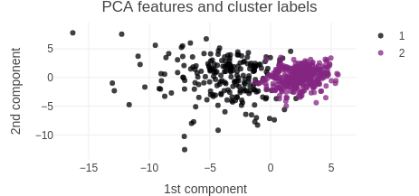
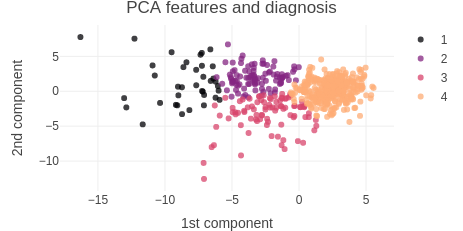

# Unsupervised learning performed on the Breast Cancer Wisconsin (Diagnostic) Data Set

In order to illustrate a clustering analysis combined with a PCA analysis, we used human breast mass data coming from [the UIC machine learning repository](https://archive.ics.uci.edu/ml/datasets/Breast+Cancer+Wisconsin+(Diagnostic)). Features are computed from a digitized image of a fine needle aspirate (FNA) of a breast mass. They describe characteristics of the cell nuclei present in the image.  

## Attribute Information

The data set includes 32 variables and 569 observations corresponding to: 

- The mean, standard deviation and maximum of ten features measured of each cell nuclei, they are described as follows: 
    - a) radius (mean of distances from center to points on the perimeter)
    - b) texture (standard deviation of gray-scale values)
    - c) perimeter
    - d) area
    - e) smoothness (local variation in radius lengths)
    - f) compactness (perimeter^2 / area - 1.0)
    - g) concavity (severity of concave portions of the contour)
    - h) concave points (number of concave portions of the contour)
    - i) symmetry
    - j) fractal dimension ("coastline approximation" - 1)

- Id of the patient 
- Diagnosis: benign (not cancerous) and malignant (cancerous)

## Methodology

### 1. Exploratory data analysis

We have summary information (mean, std and max) provided for each of the 10 groups of cells, resulting in 30 numerical variables. In order to explore the correlation between variables, we present a correlogram which indicates the presence of several features highly correlated to each other. This suggest that it would be appropriated to preprocess the data by PCA (principal component analysis) before performing any clustering techniques on the data.

We also wanted to highlight the difference between the measures on the cancerous and non cancerous cells.   

### 2. Principal Component Analysis

In order to perform a variable section, reduce the dimension of the data set and decorrelate the variables, we perform a PCA on the scaled data. The first seven components preserve 90% of the variance in the data.

### 3. Clustering analysis

- **3.1 Hierarchical clustering** 

We perform a Hierarchical clustering analysis on the first seven components computed one step ahead. The two following algorithm variations have been considered.

- *Complete* method with a cut tree resulting in 4 clusters, 
- *Ward* method with a cut tree resulting in 2 clusters.  

- **3.2 K-means clustering**

For comparaison purposes, we run a k-mean algorithm on the same first seven components for k=2 and k=4. 

### 4. Results

The [dashboard](https://danaemirel.github.io/unsupervised-learning/) and the results were build in R. Nevertheless we include the very same analysis using python.    
