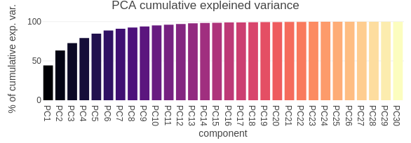

# Unsupervised learning performed on the Breast Cancer Wisconsin (Diagnostic) Data Set

In order to illustrate a clustering analysis combined with a PCA analysis, we used human breast mass data coming from [the UIC machine learning repository](https://archive.ics.uci.edu/ml/datasets/Breast+Cancer+Wisconsin+(Diagnostic)). Features are computed from a digitized image of a fine needle aspirate (FNA) of a breast mass. They describe characteristics of the cell nuclei present in the image.  

## Attribute Information

- Ten features measured of each cell nuclei
    - a) radius (mean of distances from center to points on the perimeter)
    - b) texture (standard deviation of gray-scale values)
    - c) perimeter
    - d) area
    - e) smoothness (local variation in radius lengths)
    - f) compactness (perimeter^2 / area - 1.0)
    - g) concavity (severity of concave portions of the contour)
    - h) concave points (number of concave portions of the contour)
    - i) symmetry
    - j) fractal dimension ("coastline approximation" - 1)

- Summary information is provided for each group of cells

- Diagnosis: benign (not cancerous) and malignant (cancerous)

## Methodology

### PCA

We have 30 differents features. In order to perform a variable section, reduce de dimention of the data set and decorrelate the variables, we perform a PCA on the scaled data. The first seven components preserve 90% on the variance of the data. 

### Hierarchical clustering 

We perform a Hierarchical clustering analysis on the pca computed one step ahead, the two following variants have been considered. 

- *complete* method with a cut tree resulting in 4 clusters, 
- *ward* method with a cut tree resulting in 2 clusters.  

### K-means clustering

For comparaison purposes, we run a k-mean algorithm on the same first seven components for k=2 and k=4. The results are available via the following link:

https://danaemirel.github.io/unsupervised-learning/

